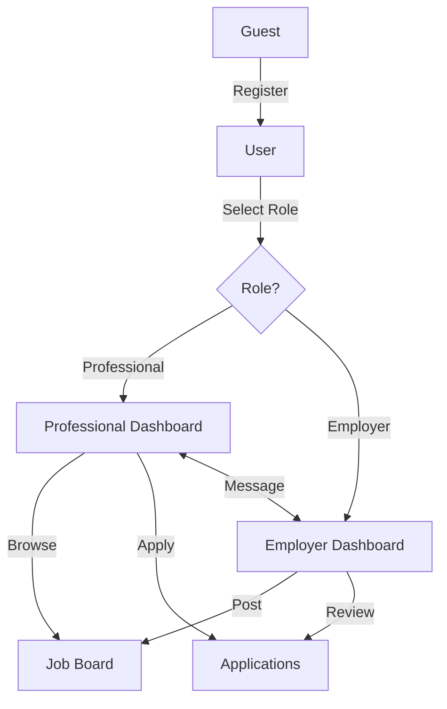

# Software Requirements Specification (SRS)

## Bilingual Job Matching Platform

**Version:** 1.0  
**Date:** February 4, 2026  
**Prepared for:** Freelance Client

---

## 1. Introduction

### 1.1 Purpose

This document specifies the software requirements for a **Bilingual Job Matching Platform** that connects Employers with Professionals in both Arabic and English languages.

### 1.2 Scope

The platform enables:

- Employers to post job listings and review applications
- Professionals to discover jobs and submit applications
- Real-time messaging between matched parties
- Full Arabic (RTL) and English (LTR) language support

### 1.3 Definitions & Acronyms

| Term  | Definition                                  |
| ----- | ------------------------------------------- |
| RTL   | Right-to-Left (Arabic text direction)       |
| LTR   | Left-to-Right (English text direction)      |
| RLS   | Row Level Security (Supabase authorization) |
| JSONB | PostgreSQL JSON Binary data type            |

---

## 2. Overall Description

### 2.1 Product Perspective

A standalone web application built with Next.js 16 and Supabase, accessible via modern browsers on desktop and mobile devices.

### 2.2 User Classes

| User Role        | Description              | Key Permissions                                       |
| ---------------- | ------------------------ | ----------------------------------------------------- |
| **Guest**        | Unauthenticated visitor  | View jobs, View public profiles                       |
| **Professional** | Registered job seeker    | Apply to jobs, Upload CV, Message employers           |
| **Employer**     | Registered hiring entity | Post jobs, Review applications, Message professionals |
| **Admin**        | Platform administrator   | Manage users, Moderate content                        |

### 2.3 Operating Environment

- **Frontend:** Next.js 16, React 19, Tailwind CSS v4
- **Backend:** Supabase (PostgreSQL, Auth, Realtime, Storage)
- **Browsers:** Chrome 90+, Firefox 90+, Safari 15+, Edge 90+
- **Languages:** English, Arabic (with RTL support)

### 2.4 Constraints

- Must support full RTL layout for Arabic users
- Must comply with GDPR for user data handling
- Milestone-based delivery required

---

## 3. Functional Requirements

### 3.1 Authentication Module (FR-AUTH)

| ID         | Requirement                                                                     | Priority |
| ---------- | ------------------------------------------------------------------------------- | -------- |
| FR-AUTH-01 | System shall allow registration via email/password                              | High     |
| FR-AUTH-02 | System shall validate email format and password strength                        | High     |
| FR-AUTH-03 | System shall support role selection (Employer/Professional) during registration | High     |
| FR-AUTH-04 | System shall persist user sessions across page refreshes                        | High     |
| FR-AUTH-05 | System shall redirect unauthenticated users from protected routes               | High     |

### 3.2 Profile Module (FR-PROF)

| ID         | Requirement                                                             | Priority |
| ---------- | ----------------------------------------------------------------------- | -------- |
| FR-PROF-01 | Professionals shall create profiles with bilingual name and bio (EN/AR) | High     |
| FR-PROF-02 | Professionals shall upload CV/resume documents                          | Medium   |
| FR-PROF-03 | Employers shall create company profiles with branding                   | High     |
| FR-PROF-04 | Users shall upload and manage profile avatars                           | Medium   |
| FR-PROF-05 | Profiles shall be publicly viewable by all users                        | High     |

### 3.3 Job Board Module (FR-JOBS)

| ID         | Requirement                                                           | Priority |
| ---------- | --------------------------------------------------------------------- | -------- |
| FR-JOBS-01 | Employers shall create job listings with bilingual title/description  | High     |
| FR-JOBS-02 | System shall display job listings with search and filter capabilities | High     |
| FR-JOBS-03 | Professionals shall apply to jobs with cover letter                   | High     |
| FR-JOBS-04 | Employers shall view and manage applications for their jobs           | High     |
| FR-JOBS-05 | System shall implement job matching based on skills/tags              | Medium   |

### 3.4 Messaging Module (FR-MSG)

| ID        | Requirement                                       | Priority |
| --------- | ------------------------------------------------- | -------- |
| FR-MSG-01 | Matched users shall send real-time messages       | Medium   |
| FR-MSG-02 | System shall display unread message notifications | Medium   |
| FR-MSG-03 | Messages shall persist and be retrievable         | Medium   |

### 3.5 Internationalization Module (FR-I18N)

| ID         | Requirement                                                            | Priority |
| ---------- | ---------------------------------------------------------------------- | -------- |
| FR-I18N-01 | System shall support EN and AR languages via URL prefix (`/en`, `/ar`) | High     |
| FR-I18N-02 | UI shall flip to RTL layout for Arabic locale                          | High     |
| FR-I18N-03 | All user-facing text shall be translatable via JSON dictionaries       | High     |
| FR-I18N-04 | System shall use locale-appropriate fonts (Inter/IBM Plex Arabic)      | High     |

---

## 4. Non-Functional Requirements

### 4.1 Performance (NFR-PERF)

| ID          | Requirement         | Target            |
| ----------- | ------------------- | ----------------- |
| NFR-PERF-01 | Page load time      | < 3 seconds on 4G |
| NFR-PERF-02 | Time to Interactive | < 2 seconds       |
| NFR-PERF-03 | API response time   | < 500ms average   |

### 4.2 Security (NFR-SEC)

| ID         | Requirement                                              |
| ---------- | -------------------------------------------------------- |
| NFR-SEC-01 | All data transmission via HTTPS                          |
| NFR-SEC-02 | Passwords hashed using bcrypt (via Supabase Auth)        |
| NFR-SEC-03 | Row Level Security (RLS) enforced on all database tables |
| NFR-SEC-04 | Users cannot access/modify other users' private data     |

### 4.3 Usability (NFR-USE)

| ID         | Requirement                                                    |
| ---------- | -------------------------------------------------------------- |
| NFR-USE-01 | Forms shall provide validation feedback in user's language     |
| NFR-USE-02 | UI shall be responsive (mobile, tablet, desktop)               |
| NFR-USE-03 | Accessibility compliance (keyboard navigation, screen readers) |

### 4.4 Reliability (NFR-REL)

| ID         | Requirement           | Target |
| ---------- | --------------------- | ------ |
| NFR-REL-01 | System uptime         | 99.5%  |
| NFR-REL-02 | Data backup frequency | Daily  |

---

## 5. System Features Summary

---

## 6. Data Requirements

### 6.1 Database Schema (JSONB for Bilingual Fields)

| Table          | Key Fields                                                            | Notes                             |
| -------------- | --------------------------------------------------------------------- | --------------------------------- |
| `profiles`     | id, full_name (JSONB), role, bio (JSONB), avatar_url                  | Links to auth.users               |
| `jobs`         | id, employer_id, title (JSONB), description (JSONB), category, budget | JSONB for EN/AR                   |
| `applications` | id, job_id, applicant_id, status, cover_letter                        | Status: pending/accepted/rejected |

---

## 7. Acceptance Criteria

| Module  | Criterion                                              |
| ------- | ------------------------------------------------------ |
| Auth    | User can register, login, logout, and session persists |
| Profile | Profile displays in correct language based on route    |
| Jobs    | Employer can post job visible in both `/en` and `/ar`  |
| i18n    | UI flips correctly between LTR and RTL                 |

---

## 8. Appendix

### 8.1 Technology Stack

- **Framework:** Next.js 16 (App Router)
- **Database:** Supabase PostgreSQL
- **Auth:** Supabase Auth (Email/Password)
- **UI Libraries:** Shadcn UI, Magic UI, Aceternity UI
- **i18n:** next-intl
- **Styling:** Tailwind CSS v4

### 8.2 References

- [IEEE 830-1998 SRS Standard](https://standards.ieee.org/standard/830-1998.html)
- [Next.js Documentation](https://nextjs.org/docs)
- [Supabase Documentation](https://supabase.com/docs)
